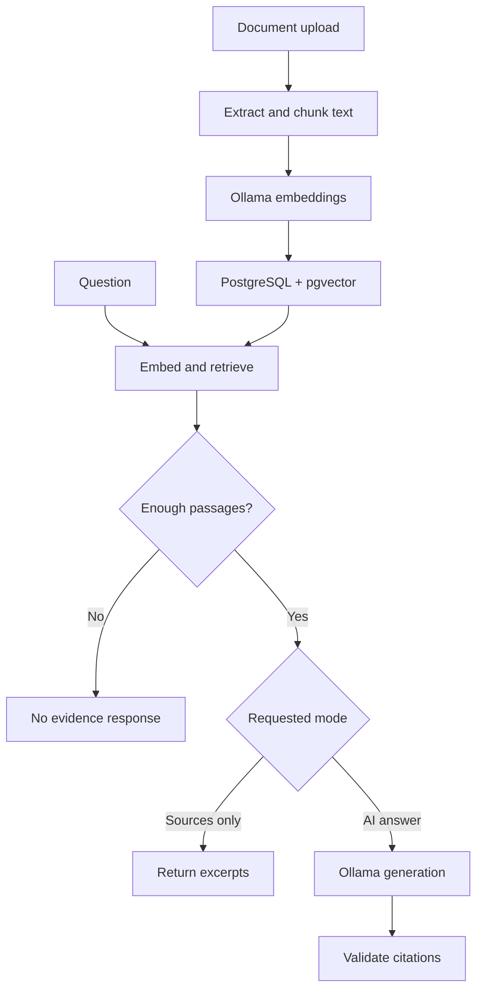

# Architecture

## Two separate flows

React calls Spring Boot. `DocumentService` owns ingestion and `RagService` owns question answering. `AiClient` uses Spring AI for both embedding and structured generation. `KnowledgeStore` uses JDBC and pgvector SQL rather than a Spring AI vector-store adapter.

## Persistence

`knowledge_document` holds a UUID, original display filename, SHA-256 byte hash, embedding model name, chunk count and timestamp. `knowledge_chunk` holds its own UUID, owner document UUID, ordinal, optional PDF page, extracted content and `vector(768)`.

A foreign key with `ON DELETE CASCADE` removes vectors with their document. Identical upload bytes have a unique hash. Embeddings are computed before opening the write transaction, so a model failure cannot commit a partially indexed document. Deadline checks occur before insertion and before commit; a transport disconnect or timeout near commit still requires refreshing the library to determine the outcome.

Vector search sorts by cosine distance using `<=>` and limits results to five, with optional UUID filtering. Java then removes hits below the configured similarity threshold. For this small corpus, exact search avoids approximate-index tuning. Scores do not represent answer confidence.

## Generation and validation

The model receives the question, at most five numbered passages and instructions to treat source text as untrusted reference data. It returns `answerable`, `answer` and a list of citation numbers. Java validates reference bounds and exact correspondence between inline numbers and the citation list. On abstention, Java supplies a fixed no-evidence message.

There is no automatic semantic verification of individual claims. Prompt injection remains a model risk: the prompt tells the model to ignore document instructions, but that is not a guaranteed security boundary. No tools are registered for generation and document text is rendered as React text, not executable HTML.

## Local concurrency

A semaphore admits one AI operation. It stays held until its worker exits, even if the HTTP caller has timed out. The default deadline is 120 seconds; individual model HTTP reads use a 60-second timeout. The gate also serializes document deletion with ingestion and queries in this one application instance.

This is not a distributed lock. Run a single backend instance against the workspace. The limits and local-only binding are suitable for a learning project, not a public multi-tenant service.

## Data lifecycle

The original file bytes are discarded after ingestion. Extracted text, metadata and embeddings persist in the Compose volume. Queries and generated answers are not saved by the application; they remain in the active browser state until replaced/reloaded. Exports create user-managed JSON copies. Database deletion does not erase previously downloaded exports or external backups.
