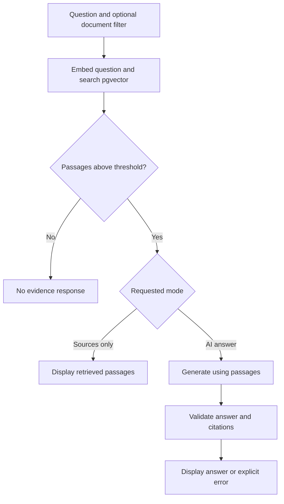

# AI Knowledge Assistant: what, why and how

**A beginner's guide to Knowledge Desk — by Sajad Ali**

This document explains the project from the problem it solves to the code that implements it. Read it before studying individual classes. It describes the current application, including its limits; proposed future features are separated at the end.

## 1. What have we built?

A local web application where you upload documents and ask questions about their contents. It searches for relevant passages, gives those passages to a language model, and displays an answer with references you can inspect.

For example, upload the included incident runbook and ask:

> How often should incident updates be posted?

The runbook says **every 30 minutes**. The application should retrieve that passage and generate an answer citing it, such as:

> The communications lead should post an update every 30 minutes [1].

This is an illustrative expected answer, not a promise that a model always produces the same wording. Clicking `[1]` takes you to the source passage.

**Project goal:** make information in documents easier to find while keeping the evidence visible.

**Intended user:** one person learning or demonstrating document Q&A on their own computer. The application is not a public service with multiple accounts.

## 2. Why build this?

Reading several policies, runbooks and engineering notes to answer one question can take time. A general language model may not know the contents of those files. It can also produce a plausible answer without evidence.

This project supplies relevant document text at question time. The user can check the model's answer against the retrieved excerpts. It also demonstrates how a Java backend can combine normal software engineering—HTTP, validation, SQL, transactions and tests—with embeddings and language-model calls.

The application aims to produce answers grounded in documents. It cannot guarantee that every generated claim is correct.

## 3. What does RAG mean?

**RAG = retrieval-augmented generation.** In this project it has three parts:

| Part | Meaning | Example |
|---|---|---|
| Retrieval | Find document passages relevant to a question. | Retrieve the paragraph about incident updates. |
| Augmentation | Add those passages to the model's input as reference material. | Include the 30-minute policy with the question. |
| Generation | Ask the model to write an answer using that material. | Produce a short answer with `[1]`. |

Uploading a document does **not** train or fine-tune the model. The model's learned parameters are unchanged. Your documents are stored separately and selected passages are included in a prompt when needed.

## 4. The requirements

### User-facing features

| Requirement | Why it exists | What completion looks like |
|---|---|---|
| Upload TXT, Markdown and text-based PDF files. | Let users bring their own reference material. | A supported file appears in the library with its passage count. |
| Extract readable text and split it into passages. | Large documents should be searchable in smaller pieces. | Text is divided into overlapping chunks; PDF page numbers are retained. |
| Generate and persist embeddings. | Enable similarity search without re-embedding every document for every question. | Text and vectors are stored in PostgreSQL. |
| Show the document library. | Users need to know what is available. | Filenames, passage counts and upload times are visible. |
| Search all documents or one selected document. | Users may want a particular policy or source. | A document UUID filter restricts database results. |
| Answer a question using retrieved context. | Turn relevant passages into a readable response. | AI answer mode returns text and valid source references, or an explicit error/abstention. |
| Offer Sources only mode. | Let users inspect retrieval independently of answer generation. | Excerpts appear without calling the chat model. |
| Display citations and source details. | Users need to verify claims. | Each source shows filename, passage number, optional page, similarity and text. |
| Handle insufficient evidence. | Avoid answering as if supporting material exists when it does not. | Empty retrieval returns `NO_EVIDENCE`; model abstention also produces a fixed no-evidence message. |
| Detect identical files. | Avoid unnecessary repeated embedding and duplicate records. | Uploading identical bytes returns the existing document. |
| Delete a document. | Users need to remove material from the corpus. | Confirmation deletes metadata and all associated passages/vectors. |
| Export the current result. | Let users inspect or save the response. | A JSON file contains the answer, citations and source excerpts. |

Sources only still calls the **embedding** model for the question. It skips the **chat** model, so it is not a model-free demo mode.

### Reliability and data requirements

| Requirement | Current implementation |
|---|---|
| Reject invalid requests with useful errors. | File/type/text limits, question validation and structured HTTP errors. |
| Avoid partial document indexing. | All embeddings must succeed before metadata and chunks are inserted in one transaction. |
| Avoid mixing incompatible embedding spaces. | Stored model names are checked; vectors must have 768 finite values and nonzero norm. |
| Bound model work. | One admitted AI operation at a time, caller deadline and per-request HTTP timeout. |
| Check generated output. | Structured response parsing, answer-length checks and citation-reference validation. |
| Preserve evidence. | Source excerpts come from stored passages, not from text invented by the answer model. |
| Persist documents across restarts. | PostgreSQL data remains in the Compose volume. |
| Support desktop and mobile use. | Responsive React interface and automated browser checks. |
| Support repeatable builds. | Maven wrapper, npm lockfile, Docker Compose and GitHub Actions. |

For numbered requirement IDs and acceptance criteria, see [Project requirements](PROJECT_REQUIREMENTS.md).

## 5. Why these technologies?

| Technology | Its job in this application | Why we chose it here |
|---|---|---|
| Java 21 | Application logic, records, validation and concurrency. | Builds on an existing Java developer skill set. |
| Spring Boot | Starts the backend and exposes REST endpoints. | Keeps configuration and HTTP handling familiar. |
| Spring AI | Calls embedding and chat models through Java APIs. | Connects the Java application to Ollama and converts structured model output. |
| React | Upload forms, document selection, answers and evidence panels. | Makes loading, errors and source navigation interactive. |
| Ollama | Runs the downloaded models locally. | Supports a local workflow without a paid model API key. |
| PostgreSQL | Stores document metadata and extracted passages. | Provides relational integrity and transactions. |
| pgvector | Stores vectors and compares their similarity. | Keeps text, ownership and vectors in one database. |
| Spring JDBC | Executes parameterized SQL. | Makes vector queries and document transactions explicit in the code. |
| PDFBox | Extracts text from PDF pages. | Supports PDF text extraction while retaining page references. |
| Docker Compose | Starts a configured PostgreSQL/pgvector instance. | Gives developers a repeatable database setup. |
| Vite | Runs and builds the frontend. | Provides the frontend development server and production bundle. |

Spring AI is used for embeddings and generation. This application uses its own JDBC queries for pgvector storage/search; it does not use Spring AI's `PgVectorStore` adapter.

## 6. Why are there two models?

| Model role | Default model | Input | Output |
|---|---|---|---|
| Embedding | `nomic-embed-text` | Document passage or question | A vector of 768 numbers |
| Generation | `llama3.2` | Question, retrieved passages and instructions | A structured natural-language answer |

An embedding is a numerical representation used for comparison. The individual numbers are not readable facts or an answer. The generation model produces the words you see.

Documents and questions must use the same embedding model so their vectors are comparable. Keeping the vector length the same is not enough: two different models can use different representations. The app checks model names, but it cannot detect a changed model downloaded under the same tag.

## 7. How does uploading work?

Follow the file `examples/incident-runbook.md`:

1. **Browser:** React creates a multipart upload containing the selected file.
2. **HTTP:** `POST /api/documents` reaches `KnowledgeController`.
3. **Admission:** `DocumentService` uses `WorkGate` so only one model operation runs at a time.
4. **Duplicate check:** Java calculates a SHA-256 hash of the file bytes and checks whether those exact bytes were uploaded already.
5. **Extraction:** `TextExtractor` reads UTF-8 text or extracts PDF page text.
6. **Chunking:** The text is divided into passages of up to 1,200 Java characters, with roughly 200 characters of overlap. PDF chunks stay within individual pages.
7. **Embedding:** `AiClient` sends batches of up to eight passages to Ollama through Spring AI.
8. **Validation:** Java checks the returned vector count, dimensions and values.
9. **Storage:** `KnowledgeStore` inserts the document row and every chunk/vector inside one PostgreSQL transaction.
10. **UI update:** React refreshes the library and displays the passage count.

**Why overlap?** Information near a chunk boundary can otherwise lose nearby context. Overlap keeps some text in both neighbouring passages. It can also produce repetitive search results; it is a trade-off, not a guarantee of better retrieval for every document.

**Why embed before the database transaction?** A slow model call should not hold an open document-write transaction. If embedding fails, no partially indexed document has been saved.

## 8. How does answering work?

For “How often should incident updates be posted?”:

1. React submits `question`, optional `documentId`, and `mode` to `POST /api/questions`.
2. `RagService` checks the question, library and embedding-model compatibility.
3. `AiClient` creates an embedding for the question.
4. `KnowledgeStore` compares that vector against stored passage vectors, optionally restricting the search to one document.
5. PostgreSQL returns the five nearest passages. Java removes any below the configured similarity threshold.
6. If none qualify, Java returns `NO_EVIDENCE` without a generation request.
7. Sources only returns the qualifying passages immediately.
8. AI answer mode sends the question and numbered passages to the chat model. The prompt asks it to use only supplied evidence and decline unsupported questions.
9. The model returns `answerable`, `answer` and `citations`.
10. Java checks the answer structure and reference numbers. React then displays the response and its retrieved sources.

## 9. How does vector search work here?

The SQL uses pgvector's cosine-distance operator, `<=>`. Lower distance means the vector directions are closer. The application displays similarity as `1 - distance`.

This is **exact search** over a small corpus, rather than an approximate vector index. The default settings retrieve at most five passages and retain those with similarity of at least `0.45`.

A result displayed as “80% similarity” does **not** mean the answer is 80% correct. It describes a vector comparison. The threshold is an initial setting that should be evaluated on real questions and documents.

If the wrong passage is retrieved, the generation model may not have enough information to answer correctly. Inspect Sources only first when debugging answer quality.

## 10. What do citations prove?

The backend checks that:

- An answerable response contains a nonblank answer and citation numbers.
- Every citation number points to a retrieved source.
- Numbers in the answer's `[1]`-style references match the returned citation list.

It does not check that every sentence logically follows from the passage. A model can write an incorrect statement and attach an existing source number. You must still read the excerpt, especially for important claims.

Retrieved passages that were not cited are also shown and labelled as retrieved. A model abstention may therefore show sources while saying there was not enough supporting evidence.

## 11. What is stored, and where?

| Data | Location/lifetime |
|---|---|
| Filename, document UUID, hash, model name, passage count and upload time | PostgreSQL document table |
| Extracted passage text, vectors, ordinals and PDF page numbers | PostgreSQL chunk table |
| Original uploaded file bytes | Used during ingestion; not retained as original files |
| Question and current answer | Active browser/application request state; not saved as server chat history |
| Exported answer JSON | A separate file downloaded by the user |

Deleting a document cascades to its chunk rows. Previously downloaded JSON files are separate copies and are not removed by deleting the database document.

The default Ollama endpoint is local. If you configure an external endpoint, document text/questions are sent to that configured service.

## 12. Limits and failure behavior

| Situation | Expected behavior |
|---|---|
| Unsupported file type | Reject it; TXT, MD and text-based PDF are supported. |
| Empty or image-only PDF | Explain that no readable text was found; OCR is not included. |
| Large upload | Enforce 5 MB, 60 PDF pages, 60,000 extracted characters and 100 chunks per document. |
| More than 50 documents | Ask the user to delete a document before adding another. |
| Blank question or more than 2,000 characters | Return a validation error. |
| Identical upload bytes | Return the existing document instead of indexing again. |
| Ollama unavailable | Return an explicit model error. |
| Another AI operation is running | Return HTTP 429 rather than queueing more model work. |
| Caller deadline exceeded | Return HTTP 504; the worker may still be finishing. |
| Invalid generated citations | Reject the model answer rather than display invented references. |
| PostgreSQL unavailable | Report storage failure; backend startup also requires the database. |

The default caller deadline is 120 seconds, and an individual model HTTP read has a 60-second timeout. A timed-out upload can be ambiguous near commit: refresh the library before retrying. The slot is not released until its worker exits.

## 13. How do I run and test it?

The [README](../README.md#run-step-by-step) contains the exact installation commands. Run them from the project root, where `pom.xml` and `frontend/` are visible.

You need Java 21, Node.js 22.12+, PostgreSQL/pgvector and Ollama with both models downloaded. The development UI runs at **5174**, the Java API at **8081**, the database at **5433**, and Ollama at **11434**.

Use this first-run checklist:

- [ ] Start the database and Ollama, then the backend and frontend.
- [ ] Upload `examples/incident-runbook.md`.
- [ ] Ask about update frequency and inspect the 30-minute passage.
- [ ] Click its citation and compare the generated wording with the evidence.
- [ ] Repeat in Sources only mode.
- [ ] Upload `examples/engineering-handbook.md` and select it before asking about code reviews.
- [ ] Upload identical bytes again and confirm no extra document appears.
- [ ] Ask an unsupported question and inspect whether the model declines appropriately.
- [ ] Export JSON, then delete a sample document and verify it leaves the library.

Automated checks include Java unit tests, real pgvector integration tests and desktop/mobile browser tests. The model responses in CI are controlled test responses. A green build verifies those software behaviors, not the quality of a live model. See [Evaluation](EVALUATION.md) for results and the live-model checklist.

## 14. Which files should I understand first?

All Java paths below start at `src/main/java/com/sajad/knowledge/`.

| Order | File | What to understand |
|---|---|---|
| 1 | `api/KnowledgeController.java` | How HTTP requests enter Java. |
| 2 | `document/TextExtractor.java` | How file bytes become passages. |
| 3 | `document/DocumentService.java` | How upload checks, embeddings and storage fit together. |
| 4 | `store/KnowledgeStore.java` | How transactions, filtering and vector SQL work. |
| 5 | `rag/AiClient.java` | What is sent to the embedding and chat models. |
| 6 | `rag/RagService.java` | When to retrieve, generate, decline or reject citations. |
| 7 | `config/WorkGate.java` | How the semaphore and deadline protect model work. |
| 8 | `api/Errors.java` | How failures become useful HTTP responses. |

Then read `frontend/src/main.jsx` and `src/main/resources/schema.sql`. Use the tests as concrete examples of how each part is expected to behave.

## 15. What is outside this project?

This version has no user accounts, tenant isolation, OCR, DOCX import, web crawling, conversation memory, model training or automatic actions. Run it as a single local backend instance, not a public multi-user service.

Potential future requirements include authenticated workspaces, background ingestion jobs, more file formats, a labelled retrieval evaluation dataset and an approximate vector index for a much larger corpus. These are future ideas, not completed features.

## 16. How can I explain the project simply?

“I built a local document Q&A portfolio application using Java, Spring Boot, Spring AI, React and pgvector. It splits uploaded documents into passages, creates embeddings, retrieves relevant context and asks an Ollama model to generate a cited answer. Users can inspect the original passages, search one document, or use retrieval without generation. The application includes validation, transactions, timeouts and automated tests. It was developed with AI assistance, and I am studying the implementation and trade-offs.”

Start by explaining one upload and one question in your own words. Once you can follow those two flows through the code, the rest of the project becomes much easier to understand.
